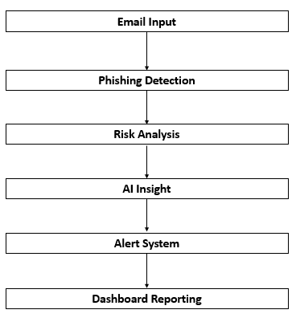
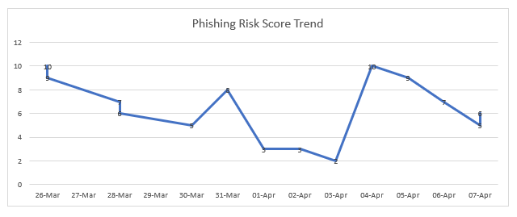
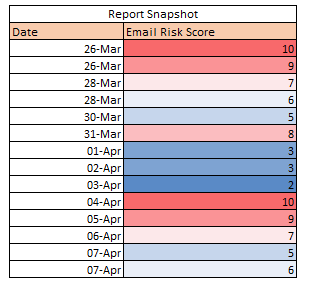

# 🛡️ Mail-Shield: AI-Powered Phishing Detection & Reporting System

> 🏆 **Recognized as a Top 100 Innovation Solution — PwC Internal Competition**

---

## Overview

Mail-Shield is a portfolio demonstration of an AI-assisted phishing detection
and automated reporting workflow, originally developed in an enterprise
environment at PwC.

The enterprise version was built using **Microsoft Power Automate, Microsoft
Copilot, and the Microsoft 365 ecosystem**. This repository presents a
sanitized Python simulation of the same underlying detection logic and
workflow — without exposing any confidential or proprietary data.

---

## 🔴 Problem

Manual phishing reporting is slow and depends entirely on individual users
recognising suspicious emails. In large organisations, this delay increases
security risk and puts pressure on cybersecurity teams.

---

## ✅ Solution

Mail-Shield automates the full detection-to-reporting pipeline:

- Scans incoming email data for phishing indicators
- Assigns a risk score to each email
- Routes high-risk emails to the cybersecurity team automatically
- Generates dashboards for ongoing threat monitoring

---

## 🏆 Business Impact

| Metric | Result |
|---|---|
| Reporting time | Reduced from ~5 minutes to near-instant |
| Time saved | ~42 business hours per team |
| Recognition | Top 100 solution — PwC Internal Innovation Competition |
| Scalability | Designed for enterprise-wide deployment across M365 |

---

## ⚙️ Workflow

1. Email is received in mailbox
2. Power Automate checks predefined phishing conditions
3. If triggered, email is marked as suspicious
4. Alert is sent to Microsoft Teams
5. Copilot agent assigns risk score
6. Final alert is shared with cybersecurity team
   
Email Input -> Phishing Detection -> Risk Analysis -> AI Insight -> Alert System -> Dashboard Reporting

 

---

## 🧠 Detection Logic

The Python simulation implements rule-based detection across three dimensions:

- **Keyword scoring** — subject lines and email body are scanned for
  high-risk phishing terms (e.g. "verify your account", "urgent action")
- **Domain analysis** — sender domains are checked against known suspicious
  patterns and spoofed brand formats
- **Risk classification** — emails are scored and bucketed into Low / Medium
  / High risk tiers for routing decisions

> In the enterprise implementation, this logic was embedded into a
> Power Automate flow that ran automatically on incoming M365 mailbox events.

---
##📊 Sample Output

The system generates structured outputs that help identify and monitor phishing risk over time.


### Risk Score Trend



This chart shows how phishing risk scores vary over time, helping identify unusual spikes in suspicious activity.

---

### Sample Risk Classification Table



This table demonstrates how emails are assigned risk scores and categorized into risk levels (Low, Medium, High) based on detection logic. These outputs simulate how the Mail-Shield system supports real-time monitoring and decision-making.

## 🚀 How to Run
```bash
# 1. Clone the repository
git clone https://github.com/prantadasguptade/mail-shield-phishing-detection.git

# 2. Navigate into the project folder
cd mail-shield-phishing-detection

# 3. Install dependencies
pip install -r requirements.txt

# 4. Run the detection script
cd src
python detect.py --input ../sample_data/emails.csv
```

---

## 🛠️ Technologies

**Enterprise Implementation (PwC):**
- Microsoft Power Automate
- Microsoft Copilot
- Microsoft 365 / Teams

**Portfolio Simulation (this repo):**
- Python 3
- pandas
- Rule-based classification logic
- Basic data visualisation

---

## 🔮 Future Improvements

The current rule-based approach prioritises **transparency and
explainability** — every decision can be traced to a specific rule. A
natural next step would be to train a supervised ML classifier
(e.g. Naive Bayes or Random Forest) to improve recall on novel phishing
patterns not covered by existing rules, while retaining rule-based
logic as an interpretable fallback.

---

## ⚠️ Limitations

- Rule-based detection may not catch novel, highly targeted phishing emails
- May generate false positives on legitimate emails with urgent language
- This repo contains no real email data or enterprise configuration

---

## 📌 Note

This repository is a sanitised demonstration created for portfolio purposes.
It does not include confidential enterprise data, internal workflows,
or proprietary PwC configurations.

---

## 👤 About the Author

**Pranta Dasgupta** — Data Analyst with 5+ years at PwC and Tata AIG,
specialising in business analytics, workflow automation, and AI-driven
solutions.

📍 India | 🎯 Targeting MSc Business Analytics / Digital Engineering in Germany

🔗 [LinkedIn](https://www.linkedin.com/in/prantadasgupta/) | 
📧 pranta.dasgupta.de@gmail.com
